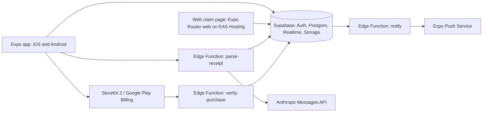

# ForkOver: v1 Spec (revision 2)

Revision 2 rewrites the single-phone spec to match the ForkOver PRD. IDs like FR-12 and NFR-3 refer to PRD requirements. Section 14 lists what changed from revision 1.

## 0. How to use this document (instructions for the coding agent)

- Read this whole file before writing code. Work one milestone at a time (section 11) and stop at each checkpoint to report back with test output and screenshots.
- Two test files are contracts: `src/lib/split/split.test.ts` and `src/lib/claims/resolve.test.ts`. Implement `split.ts` and `resolve.ts` to make them pass. Never edit or delete an expectation in either file. If a test looks wrong, stop and ask.
- Load the `expo-overview` skill first and let it route to the other Expo skills. Use the Expo MCP server for docs, installs, simulator screenshots, and taps. Use the Supabase CLI for local development, migrations, and database tests.
- If this spec is ambiguous or conflicts with an Expo or Supabase skill or doc, ask. Do not add features outside section 1 scope.
- Section 13 lists defaults chosen in this revision. Treat them as decided unless the human changes them, but flag any that cause trouble.

## 1. Product

ForkOver is a fast, polished bill splitter for friend groups at restaurants, on iOS, Android, and the web. One person, the payer, scans the receipt. AI reads the items. Everyone at the table claims what they had, from the app or a browser, and sees what they owe instantly, with every share adding up to the receipt. Friends repay the payer on Venmo.

ForkOver competes on speed and polish. The headline target is a median of under 15 seconds from shutter press to bill sent (NFR-2).

**Glossary.** "Cents" means minor units of the bill's currency everywhere in this spec and in the code (whole yen for JPY, thousandths for KWD). Field names keep the `Cents` suffix.

### Roles

- **Payer**: paid the whole bill. Always has the app and an account. Scans, reviews, sends, controls the bill.
- **Member**: a friend with the app and an account, added to the bill in the app or by opening its link.
- **Guest**: a friend without the app, on the web claim page. Types a name, never creates an account (FR-21).
- **Named person**: someone the payer adds by name to claim for, such as a friend whose phone died (FR-32).

### v1 scope

- Sign in with Apple or Google before first use (FR-20). Username (FR-22). Optional Venmo username.
- Scan a receipt photo, parse with Claude vision, streamed to the review screen (FR-1, NFR-2).
- Payer review before sending, every time (FR-3), with a subtotal check and editing.
- Quantity lines split into separate claimable items (FR-2).
- Tip read from the receipt; if none is readable, no tip unless the payer adds one (FR-11).
- Manual entry as a fallback (section 13, default 7).
- Send by in-app invite, web link, or table QR code (FR-4, FR-5, FR-23).
- Live claiming on app and web: "Mine" or "Shared" per item, with instant totals (FR-6 to FR-9).
- Payer controls: claim for anyone, assign or split unclaimed items, resolve conflicts, edit after sending, mark items paid, close the bill (FR-12 to FR-18, FR-24, FR-25, FR-32, FR-37, FR-38).
- Pay on Venmo links for USD bills (FR-19, FR-31).
- Any currency, split in the receipt's own currency (FR-30).
- Free tier of 3 scans a month and Pro at $1.99 a month with unlimited scans (PRD Monetization).
- Push notifications (FR-35, FR-36), account deletion (FR-33, FR-34), anonymous analytics (NFR-9).

### Non-goals for v1

Moving money inside ForkOver, payment links other than Venmo, currency conversion, matching friends from phone contacts, an offline claim queue (NFR-8), unequal shares on one item (for example 70/30), multiple receipts per bill, multi-photo long receipts, and notifications for browser guests.

## 2. Core flows

### 2.1 Payer: first run

1. **Sign in**: Sign in with Apple or Google. Nothing else in the app is reachable before this.
2. **Username**: pick a unique username (section 13, default 16). Optional Venmo username field with a one-line explanation.

### 2.2 Payer: scan to send

The latency budget from the PRD, measured from shutter press:

| Step | Budget |
|---|---|
| Capture and upload the photo | 2 s |
| AI parse, streamed so items appear as they are read | 6 s |
| Payer reviews and taps "Looks right" | 4 s |
| Confirm the tip read from the receipt | 1 s |
| Send by QR code, link, or in the app | 2 s |
| **Total** | **15 s** |

1. **Home**: bills list with two tabs, "I paid" and "Shared with me". Primary button "Scan receipt"; secondary "Enter manually". Free users see scans left this month.
2. **Consent (first scan only)**: a sheet saying the receipt photo is sent to Anthropic's Claude AI to read the items, with "Allow" and "Enter manually instead". Nothing pre-selected. Stored on the profile (`ai_consent_at`), changeable in Settings, and enforced by the server (NFR-4).
3. **Scan**: camera with a large shutter button and a photo library option. The shutter press starts the latency clock (section 8.8). Upload and parse start immediately.
4. **Review**: items stream in as the AI reads them. Each item is editable (name, price), deletable, and new items can be added (FR-3). Quantity lines arrive already split into units, with a "Merge" action to undo (FR-2). Below the items: discount, tax, fees (each with a proportional or even toggle, FR-29), and tip (FR-11).
   - A green check appears when items match the printed subtotal. A warning banner appears when they don't, showing both numbers (section 7.5).
   - If the receipt has a tip, it shows with its source ("Printed tip" or "Handwritten tip"). If not, the tip row reads "No tip" with chips for 18%, 20%, 22%, and custom (section 13, default 10).
   - If the "tip we couldn't read" check fires (section 7.5), show "Looks like there's a tip we couldn't read" next to the tip row.
   - One primary button: "Looks right". It opens the bill (status `open`) and goes to Share.
5. **Share**: large QR code for the bill link, plus "Copy link", "Share link" (native share sheet), and "Send in app" (username search and recent people, FR-22). First send prompts for a Venmo username if none is set (skippable).
6. **Bill screen**: the live bill (section 2.4).

### 2.3 Claimers: members and guests

1. **Open**: a member gets a push notification (FR-35) or opens the link or QR code. The link opens the app if installed (universal links and Android App Links), otherwise the web claim page (FR-23).
2. **Join (guests only)**: type a name, 1 to 30 characters (section 13, default 11). The browser remembers the guest through an anonymous session, so reopening the link keeps their name and claims (FR-6).
3. **Claim** (FR-7): every item row has two controls. Tap the row to claim it as "Mine". Tap the "Share" chip to claim it as shared. Tap again to unclaim. Rows show who has claimed them. Your total updates instantly (FR-9, NFR-1), in a sticky card at the bottom with an expandable breakdown (items, discount, tax, tip, fees, total; no separate rounding line, section 13 default 2).
4. **Pay**: on USD bills where the payer has a Venmo username, a "Pay on Venmo" button prefilled with your remaining balance (FR-19, FR-31). On other bills, your total and balance only.
5. **Closed bills**: read-only. The web link shows a summary only (FR-25).

### 2.4 Payer: bill screen

The same live claim view, plus payer controls:

- **Claim for anyone**: pick a person (or "Add person by name") and tap items for them (FR-32).
- **Unclaimed**: a section listing unclaimed items, each with "Assign" (one or more people) (FR-12). Unclaimed items count toward the payer until assigned (FR-13).
- **Conflicts**: a section listing conflicted items with who claimed them; resolve by assigning to one person or splitting (FR-14). Until resolved, they show as "Pending" and split provisionally (FR-15).
- **Edit**: edit, add, or remove items while the bill is open (FR-37, FR-38).
- **People**: each person's total, paid, and remaining. Tap a person to mark individual items paid or "Mark all paid" (FR-17, section 6.4).
- **Close bill**: available any time; prompted automatically when every portion is paid (section 13, default 8). Paid marking still works after closing (FR-25).

## 3. Architecture



- **One codebase (NFR-7).** The app and the web claim page are the same Expo Router project. The web build ships only the public claim routes (section 4). The split engine runs identically on every platform (NFR-3).
- **Supabase** provides Auth (Apple, Google, and anonymous sessions for guests), Postgres with row-level security, Realtime, Storage for receipt photos, Edge Functions, and scheduled jobs.
- **Client computes, server stores.** The server stores bill state (items, claims, assignments, payments). Every client runs `resolveClaims` and `calculateSplit` locally on each change, so taps never wait on the network (NFR-1).
- **Secrets** exist only in Edge Functions: the Anthropic key, the Supabase service role key, and the Apple and Google server credentials used to verify purchases (9.2). Never in client code or `EXPO_PUBLIC_` variables.

## 4. Screens and routes (Expo Router)

| Route | Platforms | Purpose |
| --- | --- | --- |
| `app/(auth)/sign-in.tsx` | native | Sign in with Apple or Google |
| `app/(auth)/username.tsx` | native | Username and optional Venmo username |
| `app/(app)/index.tsx` | native | Home: "I paid" and "Shared with me" |
| `app/(app)/scan.tsx` | native | Consent gate, camera, upload, parse stream |
| `app/(app)/bill/[id]/review.tsx` | native | Review and edit (also manual entry, starting empty) |
| `app/(app)/bill/[id]/share.tsx` | native | QR code, link, send in app |
| `app/(app)/bill/[id]/index.tsx` | native | Live bill: claim view plus payer controls |
| `app/(app)/settings.tsx` | native | Account, usernames, AI consent, subscription, delete account, privacy policy |
| `app/(app)/paywall.tsx` | native | Pro upgrade and restore purchases |
| `app/b/[token].tsx` | native and web | Public bill link: join (guests), claim, pay, or closed summary |

Serve `apple-app-site-association` and `assetlinks.json` from `public/.well-known/` on the web origin so `/b/*` links open the app when installed.

## 5. Tech stack and conventions

- Expo (latest SDK at project creation), Expo Router, TypeScript strict. Follow the Expo skills for UI, navigation, and structure.
- Always add dependencies with `npx expo install`.
- Data: `@supabase/supabase-js`. Auth: `expo-apple-authentication` and a native Google sign-in library, both exchanging ID tokens with Supabase. Camera: `expo-image-picker`. Resize: `expo-image-manipulator`. Push: `expo-notifications`. Subscriptions: `react-native-iap` (StoreKit 2 and Google Play Billing, requires an Expo Dev Client since it uses native modules; Expo Go can't run it). QR: `react-native-qrcode-svg`. Connectivity: `@react-native-community/netinfo`. Haptics: `expo-haptics`. State: `zustand`.
- Tests: `jest-expo` for TypeScript. Database policies tested with pgTAP through `supabase test db`.
- Light and dark mode. Large tap targets, since this is used at a table, often one-handed.

### Module boundaries

```
src/lib/split/      split.ts, split.test.ts (contract)        pure TS, no React, no I/O
src/lib/claims/     resolve.ts, resolve.test.ts (contract)    pure TS
src/lib/balance/    balance.ts + tests                        pure TS: paid and remaining
src/lib/money/      currency.ts, parseMoneyInput.ts, format.ts + tests
src/lib/pay/        venmo.ts + tests
src/lib/receipt/    schema.ts, toBill.ts, reconcile.ts, partialJson.ts + tests
src/lib/theme/      tokens.ts, contrast.test.ts
src/state/          zustand stores (no math; call src/lib)
src/data/           Supabase client, queries, realtime subscriptions, optimistic writes
supabase/migrations/  schema, RLS policies, triggers
supabase/functions/   parse-receipt, delete-account, verify-purchase, apple-notifications,
                      google-rtdn, notify, cleanup
supabase/tests/       pgTAP tests for RLS and triggers
fixtures/receipts/    sample photos plus expected JSON
scripts/eval-receipts.ts
```

## 6. Split math and claim rules

### 6.1 Split engine (must match what `split.test.ts` imports)

```ts
export type Person = { id: string; name: string };

export type Item = {
  id: string;
  name: string;
  priceCents: number;     // integer >= 0, minor units
  assignedTo: string[];   // person ids from resolveClaims; empty means unclaimed (goes to the payer)
};

export type Tip =
  | { kind: 'amount'; cents: number }
  | { kind: 'percent'; bps: number; base: 'preTax' | 'postTax' }; // 1800 bps = 18%

export type Fee = { id: string; label: string; cents: number; split: 'proportional' | 'equal' };

export type Bill = {
  payerId: string;        // must be in people
  people: Person[];
  items: Item[];
  discountCents: number;  // receipt-level, positive number
  taxCents: number;
  tip: Tip;
  fees: Fee[];
};

export type PersonShare = {
  personId: string;
  itemsCents: number;
  discountCents: number;  // positive number that was subtracted
  taxCents: number;
  tipCents: number;
  feesCents: number;
  roundingCents: number;  // reconciles the breakdown with totalCents; sums to 0 across people
  totalCents: number;
};

export type BillTotals = {
  subtotalCents: number;
  discountCents: number;
  taxCents: number;
  tipCents: number;
  feesCents: number;
  grandTotalCents: number;
};

export type SplitError =
  | { code: 'NO_PEOPLE' }
  | { code: 'UNKNOWN_PAYER'; payerId: string }
  | { code: 'DUPLICATE_PERSON_ID'; personId: string }
  | { code: 'UNKNOWN_ASSIGNEE'; itemId: string; personId: string }
  | { code: 'INVALID_AMOUNT'; field: string } // e.g. 'taxCents', 'tip.bps', 'items.<id>.priceCents', 'fees.<id>.cents'
  | { code: 'DISCOUNT_EXCEEDS_SUBTOTAL' };

export type SplitResult =
  | { ok: true; shares: PersonShare[]; totals: BillTotals }
  | { ok: false; errors: SplitError[] };

export function allocate(totalCents: number, weights: number[]): number[];
export function percentOf(baseCents: number, bps: number): number;
export function calculateSplit(bill: Bill): SplitResult;
```

### 6.2 Claim resolution (must match what `resolve.test.ts` imports)

```ts
export type ClaimMode = 'mine' | 'shared';
export type Claim = { itemId: string; personId: string; mode: ClaimMode; createdBy: string };
export type PayerAssignment = { itemId: string; assignedTo: string[] };
export type ItemClaimState = 'unclaimed' | 'claimed' | 'shared' | 'conflict' | 'assigned';
export type ResolvedItem = { itemId: string; assignedTo: string[]; state: ItemClaimState };

export function resolveClaims(input: {
  itemIds: string[];
  claims: Claim[];
  assignments: PayerAssignment[];
}): ResolvedItem[];
```

Rules, in priority order:

1. A payer assignment with at least one person wins over all claims: state `assigned` (FR-12, FR-14). An empty assignment is ignored.
2. No claims: `unclaimed`, `assignedTo: []`. The split engine puts it on the payer (FR-13).
3. One claimant in either mode: `claimed`, that person alone.
4. Two or more claimants, all `shared`: `shared`, split equally (FR-8).
5. Two or more claimants, any `mine`: `conflict`, provisionally split equally among all claimants until the payer resolves it (FR-14, FR-15).

Claims are keyed by (itemId, personId), and a later entry replaces an earlier one. `createdBy` never affects resolution, so the payer can claim on anyone's behalf (FR-32). The pipeline on every state change is `resolveClaims`, then `calculateSplit`, then `computeBalances` (6.4), memoized per bill.

### 6.3 Split math rules

The tests encode these; this is the human-readable version.

1. All money is integer minor units in state, storage, and math. Format only at render time (6.5).
2. `allocate` uses the largest remainder method: floor each proportional share, then hand out leftover cents to the largest fractional remainders. Ties go to the earliest index. If every weight is 0, split equally.
3. Unclaimed items (empty `assignedTo`) belong to the payer (FR-13).
4. Order of operations for the breakdown columns:
   1. Each item is split equally among its assignees, ties by `bill.people` order.
   2. The discount is allocated by each person's item subtotal (FR-27).
   3. Tax is allocated by post-discount subtotal (FR-10).
   4. Tip total is an amount, or `percentOf(base, bps)` where base is the post-discount subtotal (`preTax`) or that plus tax (`postTax`), rounded half up. Allocated by post-discount subtotal.
   5. Proportional fees are allocated by post-discount subtotal. Equal fees are allocated equally among people with at least one item (FR-28).
   6. When every post-discount subtotal is zero, tax, tip, and proportional fees split equally among people with at least one item. If nobody has items, everything goes to the payer.
5. **Totals (FR-26).** Every person except the payer owes exactly the floor of their exact, unrounded share, computed with rational arithmetic on BigInt (no floats). The payer's total is the grand total minus everyone else's. `roundingCents` is each person's total minus their breakdown columns, and sums to 0. It is not shown as its own line; the UI folds it into the displayed tax amount (section 13, default 2), so the displayed columns always add up to the displayed total.
6. A person with no items owes $0, including equal-split fees (FR-28). The payer is the one exception: the payer absorbs rounding even with no items.
7. Validation collects all errors instead of stopping at the first.

### 6.4 Paid tracking and balances (`src/lib/balance`, FR-16 to FR-18)

Write tests for all of the rules below, including the worked example.

- The payer marks **portions** paid: a portion is one person's share of one item, keyed by (itemId, personId). "Mark all paid" on a person marks all their portions (section 13, default 4).
- **Locks (FR-17).** An item with any paid portion is locked: no edits to its name or price, and no claim or assignment changes on it by anyone, enforced by the database (section 8.2). The payer unmarks every paid portion on the item to edit it.
- Let S be the subtotal, D the discount, and X the sum of tax, tip, and proportional fees. Each portion's attributed cost is its exact item share times (S - D + X) / S.
- A person's `paidCents`: if every portion they are on is paid, it equals their `totalCents`. Otherwise it is the floor of the sum of attributed costs of their paid portions. If S - D is 0, `paidCents` is 0 until every portion is paid. Equal-fee shares count as paid only when every portion is paid.
- `remainingCents = max(0, totalCents - paidCents)`. Not shown for the payer.
- **Worked example.** The realistic receipt in `split.test.ts` (payer a; b owes 3599). The payer marks b's katsu (1895) paid. Attributed cost is 1895 x 8364 / 6490 = 2442.18, so b's paid is 2442 and remaining is 1157. After b's gyoza and sake portions are also marked paid, b's paid is exactly 3599 and remaining is 0.

### 6.5 Money and currency (FR-30)

- `currencyExponent(code)` comes from `Intl.NumberFormat` resolved options (USD 2, JPY 0, KWD 3). Verify Hermes returns the right values on both platforms in M1 and hard-code a fallback table for the currencies in the eval set if not.
- `parseMoneyInput(input, currency)` accepts digits with up to the currency's exponent of decimals, with optional symbol and grouping (`12`, `12.5`, `$12.50`, `1,234.56`; `1500` for JPY). It rejects extra decimals, negatives, and non-numbers.
- `formatMoney(cents, currency, locale)` uses `Intl.NumberFormat`.
- Quantity units (FR-2): `toBill` expands a line of quantity N into N items named like the line, priced by `allocate(lineTotal, [1, 1, ...])`.

### 6.6 Venmo links (FR-19, FR-31)

`buildVenmoPayLink({ username, amountCents, note })` returns `https://venmo.com/<username>?txn=pay&amount=<dollars with 2 decimals>&note=<note>`, with username and note URL-encoded and any leading `@` stripped. The note is `ForkOver: <bill title>`. It throws unless the amount is positive. The button renders only when the bill currency is USD, the payer has a Venmo username, and the person's remaining balance is positive. Keep link building in this one function so a format change is a one-line fix.

## 7. Receipt parsing

### 7.1 Architecture

The app resizes the photo (7.6), then POSTs it to the `parse-receipt` Edge Function. The function:

1. Verifies a signed-in, non-anonymous user and a recorded `ai_consent_at`. Otherwise `CONSENT_REQUIRED` or `UNAUTHORIZED`.
2. Checks the rate limit (10 scans per rolling hour per user) and, for free users, the monthly quota (3 successful scans per calendar month in UTC). Otherwise `RATE_LIMITED` or `QUOTA_EXCEEDED`.
3. Creates a `draft` bill, starts the upload to Storage in parallel, and calls the Anthropic Messages API with the image and the JSON schema, streaming.
4. Streams newline-delimited JSON events back to the app as they become available: `{ "type": "item", ... }` for each complete item, `{ "type": "done", "billId": ..., "receipt": ... }` at the end, or `{ "type": "error", "code": ... }`.
5. Validates the final result (7.3) and counts a quota use only on success with `isReceipt: true`.

- Env vars: `ANTHROPIC_API_KEY` (secret), `ANTHROPIC_MODEL` (`claude-sonnet-5`, chosen at the M2 checkpoint), `MAX_IMAGE_BYTES`.
- Use `@anthropic-ai/sdk` if it runs cleanly in the Edge Function runtime; otherwise call the REST endpoint with `fetch`.
- Never log image data. Store it only in the private receipts bucket (8.4).
- Streaming with structured outputs: parse the partial JSON incrementally (`partialJson.ts`) and emit each item once its object closes. If the chosen model can't stream structured output, fall back to a single response and report the latency impact at the M2 checkpoint.

### 7.2 Error codes

`UNAUTHORIZED`, `CONSENT_REQUIRED`, `QUOTA_EXCEEDED`, `RATE_LIMITED`, `TOO_LARGE`, `NOT_A_RECEIPT`, `UPSTREAM_ERROR`, `INVALID_OUTPUT`. Every error state in the app offers "Enter manually". `QUOTA_EXCEEDED` opens the paywall.

### 7.3 Structured output schema

Use JSON outputs (`output_config.format` with `type: 'json_schema'`). Docs: https://platform.claude.com/docs/en/build-with-claude/structured-outputs. Every object needs `additionalProperties: false`, and numeric constraints are not supported, so enforce ranges in code after parsing.

```ts
type ParsedReceipt = {
  isReceipt: boolean;
  merchantName: string | null;
  currency: string;                   // ISO 4217 as printed or inferred, e.g. "USD", "JPY"
  items: Array<{ name: string; quantity: number; lineTotalCents: number }>; // minor units
  discountCents: number;              // sum of discounts, coupons, comps, as a positive number
  taxCents: number;                   // sum of tax lines added on top; 0 when tax is included in prices
  fees: Array<{ label: string; cents: number }>; // surcharges, delivery, and other non-tip fees
  printedTipCents: number | null;     // auto-gratuity plus any printed or handwritten tip
  tipSource: 'printed' | 'handwritten' | 'autoGratuity' | 'mixed' | null;
  printedSubtotalCents: number | null;
  printedTotalCents: number | null;   // final total line (handwritten total if present)
  warnings: string[];                 // e.g. "bottom of receipt cut off", "handwritten tip unclear"
};
```

Keep `schema.ts` as the single source for the TypeScript type and the JSON schema. Validate at runtime: all amounts non-negative integers, quantity an integer of at least 1, currency a known ISO 4217 code. Failures return `INVALID_OUTPUT`.

### 7.4 Parser instructions (system prompt content)

- Extract line items exactly as printed. Do not invent items.
- Return every amount in the currency's minor units: cents for USD, whole yen for JPY.
- A quantity line such as "2 Beer 17.00" becomes one item with quantity 2 and line total 1700. The app expands it (6.5).
- Priced modifiers ("+ avocado 2.00") fold into the parent item's line total and name. Zero-price modifiers are ignored. Voided lines are excluded.
- Negative lines (discounts, comps, coupons) are summed into `discountCents`, never returned as negative items.
- `taxCents` is only tax added on top of the item prices. Tax already included in the prices (内税, 内消費税, "VAT included", "BTW incl.") is not added again: `taxCents` is 0.
- `printedSubtotalCents` and `printedTotalCents` come only from a subtotal or total line written on the receipt (printed, or a handwritten total when present; `printedTotalCents` is the final one). Use null when there is none, never a computed figure. Cash tendered and change are never the total.
- Automatic gratuity and any printed or handwritten tip go in `printedTipCents` with the matching `tipSource` (FR-11). Other surcharges and service fees go in `fees`.
- If the image is not a receipt, return `isReceipt: false` with empty arrays and zeros.
- Add a warning for anything uncertain rather than guessing silently.

### 7.5 Reconciliation (`reconcile.ts`)

Three checks, all shown on the review screen, none blocking:

1. **Subtotal (FR-3):** sum of items vs `printedSubtotalCents`. Match shows a green check; a mismatch shows "Items add up to $X, receipt says $Y".
2. **Total:** items - discount + tax + (tip ?? 0) + fees vs `printedTotalCents`, with the same style of message.
3. **Unreadable tip (section 13, default 9):** if no tip was read and `printedTotalCents` exceeds items - discount + tax + fees, show "Looks like there's a tip we couldn't read".

Write tests for `reconcile` and for `toBill` (quantity expansion, printed tip becomes an amount tip, no tip becomes a zero amount tip, fees default to proportional, currency carried through).

### 7.6 Image prep

Resize on device so the long edge is at most `MAX_IMAGE_LONG_EDGE` (default 1568 px; check the vision docs for the chosen model) and JPEG-compress around 0.85. Receipts are tall and narrow, so watch the eval results for misreads on long receipts.

### 7.7 Evals (decides the model)

Put at least 12 real receipt photos in `fixtures/receipts/` with a hand-written `*.expected.json` for each (the human provides these). Include a long receipt, a crumpled one, a handwritten tip, an automatic gratuity, a discount, a surcharge, a quantity line, and a non-USD receipt (JPY if possible).

`scripts/eval-receipts.ts` runs each fixture through the Edge Function logic and reports, per receipt and in aggregate:

- whether every item and price matched, and item count match
- subtotal, tax, tip, and total match
- currency match
- time to first item and time to done (median and 90th percentile)
- input and output tokens, and cost per scan

Run it for `claude-haiku-4-5-20251001` and `claude-sonnet-5` and report a comparison table. The human sets the accuracy target and picks the model at the M2 checkpoint (PRD Success metrics); the pick is `claude-sonnet-5`. Rerun the eval on every prompt or model change before it ships.

## 8. Backend

### 8.1 Data model (Postgres)

```
profiles        id (= auth user id), username (unique, case-insensitive), display_name,
                venmo_username, ai_consent_at, created_at
bills           id, payer_user_id -> profiles (on delete cascade), share_token (unique),
                title, merchant_name, currency, status ('draft' | 'open' | 'closed'),
                discount_cents, tax_cents, tip (jsonb), receipt_path, receipt_expires_at,
                created_at, sent_at, closed_at, updated_at
bill_people     id, bill_id -> bills (cascade), user_id (nullable, on delete set null),
                display_name, kind ('payer' | 'member' | 'guest' | 'named'), joined_at,
                unique (bill_id, user_id)
bill_items      id, bill_id (cascade), name, price_cents, position, created_at, updated_at
bill_fees       id, bill_id (cascade), label, cents, split ('proportional' | 'equal')
claims          item_id (cascade), person_id -> bill_people (cascade), bill_id, mode ('mine' | 'shared'),
                created_by -> bill_people, created_at; primary key (item_id, person_id)
assignments     item_id (primary key, cascade), bill_id, assigned_to (uuid[] of bill_people ids), updated_at
payments        item_id (cascade), person_id (cascade), bill_id, marked_at; primary key (item_id, person_id)
scan_usage      user_id, period ('YYYY-MM'), count; primary key (user_id, period)
scan_log        user_id, created_at (for the hourly rate limit)
entitlements    user_id (primary key), is_pro, expires_at, platform ('ios' | 'android'),
                latest_transaction_id, updated_at (written by verify-purchase and the
                platform notification webhooks)
push_tokens     user_id, token (unique), platform, updated_at
analytics_events  id, install_id, name, props (jsonb), created_at
```

`share_token` is at least 128 random bits, base64url encoded (NFR-6). Money columns are integers.

### 8.2 Access rules (row-level security on every table)

- **Membership.** A user can read a bill and its rows if they are its payer or have a `bill_people` row with their `user_id`.
- **Joining.** `join_bill(share_token, display_name)` is a security-definer function. It adds the caller as `member` (signed in) or `guest` (anonymous), or returns their existing row. It rejects closed bills.
- **Payer only.** Creating and editing items, fees, assignments, payments, bill status, and named people.
- **Claims.** A person can insert, update, or delete claims for their own `bill_people` row. The payer can do so for anyone (FR-32).
- **Triggers.** Reject claim and assignment changes when the bill is closed or the item has any payment. Reject item edits when the item has any payment (FR-17). Allow payment changes on closed bills (FR-25).
- **Username search.** `search_usernames(prefix)` returns id, username, and display name only, requires at least 2 characters, and returns at most 10 rows.
- Every policy and trigger has a pgTAP test in `supabase/tests/`, covering payer, member, guest, and outsider.

### 8.3 Realtime sync and connectivity

- Clients subscribe to Postgres changes for one bill (bills, bill_people, bill_items, bill_fees, claims, assignments, payments), filtered by `bill_id`.
- **Optimistic writes.** A tap updates the local store and recomputes totals immediately (NFR-1), then writes to Supabase. On failure, revert and show a short error.
- **Offline (NFR-8).** Detect with NetInfo on native and browser online events plus the Realtime channel status on web. Show a "No connection" banner, disable claim and edit controls, and on reconnect refetch the bill snapshot and resubscribe. No offline queue.

### 8.4 Receipt photos (NFR-5)

Stored in a private `receipts` bucket at `<bill_id>/receipt.jpg`. Bill members read it through short-lived signed URLs. The `cleanup` job deletes photos 30 days after the scan, even on open bills, and clears `receipt_path`.

### 8.5 Bill lifecycle (FR-24, FR-25)

`draft` (during review) to `open` ("Looks right") to `closed` (payer closes). Only the payer changes status. Closed bills are read-only except payment marks, and the web link shows a summary.

### 8.6 Account deletion (FR-33, FR-34)

`delete-account` Edge Function, reachable from Settings:

1. On bills someone else paid for, set the user's `display_name` to "Deleted user" and `user_id` to null. Their claims stay.
2. Delete bills the user paid for, including photos. Their links then show "This bill is no longer available".
3. Delete the profile, push tokens, and the auth user.
4. Before confirming, tell the user that deleting the account doesn't cancel an App Store or Google Play subscription, with a link to manage it.

Also publish a web page explaining how to request deletion, for the Google Play listing.

### 8.7 Notifications (FR-35, FR-36)

The `notify` function runs from database webhooks and sends through the Expo Push Service:

- To a member, when the payer sends them a bill in the app.
- To the payer, when a claim creates a conflict, and when the last unclaimed item gets claimed or assigned. Not for individual claims.

Guests get no notifications.

### 8.8 Analytics (NFR-9)

Insert-only `analytics_events` with a random per-install id, never a user id. Events: `scan_shutter`, `parse_first_item`, `parse_done`, `review_confirmed`, `bill_sent`, `claim_page_opened`, `first_claim`, `bill_closed`, `paywall_shown`, `upgrade_completed`, plus `drop_off` with the screen name. `props` accepts an allowlist of keys (durations in ms, screen names, platform, item count). Never receipt contents, item names, or amounts, and no ad tracking. The headline metric is the median of `bill_sent` minus `scan_shutter`.

### 8.9 Subscriptions

One product, Pro monthly at $1.99, sold through StoreKit 2 on iOS and Google Play Billing on Android via `react-native-iap`. On purchase, the client sends the platform receipt (an iOS JWS transaction or an Android purchase token) to the `verify-purchase` function, which validates it directly with Apple or Google, and writes `entitlements`. Renewals, cancellations, and refunds arrive at `apple-notifications` (App Store Server Notifications v2) and `google-rtdn` (Real-time Developer Notifications via Pub/Sub), which update the same table. `parse-receipt` checks `entitlements` for the quota (7.1). The paywall shows scans left, the price, and "Restore purchases", which calls `getAvailablePurchases` and re-verifies. Manual entry never counts toward the quota.

## 9. Privacy and store compliance

- **AI consent (NFR-4).** Apple guideline 5.1.2(i) requires disclosing that personal data goes to third-party AI, naming the provider, and getting explicit permission first. The consent sheet (2.2) does this in the app, the server enforces it, and the privacy policy must say the same.
- **Sign in with Apple** is offered alongside Google, as Apple requires an equivalent privacy-focused login option.
- **Account deletion** inside the app (8.6) for Apple, and a deletion web page for Google Play.
- Declare the data flows (receipt photos, account data, usage analytics) in App Store privacy labels and the Google Play Data safety form.
- Camera and photo library permission strings in plain language ("Take a photo of your receipt to split the bill").
- Abuse protection: the parse rate limit and quota (7.1), unguessable share tokens (8.1), and RLS on every table (8.2).

## 10. Accessibility (NFR-10)

From the first screen built (M3), on app and web:

- Every control and item has a screen reader label, such as "Salmon, $28.00, claimed by you".
- Layouts hold up at the largest system text sizes with nothing clipped.
- Claimed, shared, conflict, unclaimed, and paid states each use an icon or label, never color alone.
- Text meets WCAG AA contrast. `contrast.test.ts` checks every text and background token pair in both themes.

## 11. Milestones

Definition of done for every milestone: all tests pass, `npx tsc --noEmit` is clean, `npx expo lint` is clean, and you post screenshots of every changed screen on iOS and Android (and the web for claim routes). Commit at the end of each milestone.

- **M1: Pure logic.** Set up `jest-expo`. Implement `split.ts` and `resolve.ts` until both contract suites pass untouched. Add `balance`, `money`, and `venmo` with tests. *Checkpoint.*
- **M2: Receipt parsing.** Schema, the `parse-receipt` function running locally with streaming, `partialJson`, `toBill`, `reconcile`, and the eval script. Report the model comparison table. The human sets the accuracy target and picks the model. *Checkpoint.*
- **M3: Payer app on one phone.** Supabase project, sign-in, username, consent, scan with streamed review, tip, manual entry, share screen with QR, and a bill screen where the payer claims for named people and sees totals. Analytics timing events and the accessibility baseline. Drive the realistic receipt scenario from the tests through automation and confirm the totals show $25.12, $35.99, and $22.53. Report the median shutter-to-sent time over 10 fixture runs. *Checkpoint.*
- **M4: Shared bills.** Migrations, RLS, triggers, and pgTAP tests. Realtime sync with optimistic writes, the web claim page, anonymous guests, universal links, username search, in-app sending with push, and the offline banner. Show two app users and one browser guest claiming the same bill live with matching totals. *Checkpoint.*
- **M5: Payer controls.** Unclaimed and conflict sections, assignment, editing after sending, paid marks with locks, balances, Venmo buttons, payer notifications, and closing with the close prompt. Take one bill from scan to fully paid, end to end. *Checkpoint.*
- **M6: Pro and launch.** Native purchases with `react-native-iap`, `verify-purchase`, the App Store and Google Play notification webhooks, server-side quota and rate limit, paywall, photo cleanup job, account deletion, anonymous guest cleanup, privacy policy, privacy labels, the Data safety form, an accessibility audit, and store listings ("Fork Over: Split the Bill"). EAS builds to TestFlight and Google Play internal testing, then submit for review. *Checkpoint.*

## 12. Agent working rules

Copy these into `AGENTS.md` (which `CLAUDE.md` imports).

- Money is integer minor units everywhere except the final render. No floats in math.
- Pure logic lives in `src/lib` with tests. Screens, stores, and the web page call it; they never reimplement it.
- Never modify expectations in `src/lib/split/split.test.ts` or `src/lib/claims/resolve.test.ts`.
- Every schema change is a migration in `supabase/migrations/`. Every table has RLS enabled, and every policy has a pgTAP test.
- Every interactive element gets a stable kebab-case `testID` (for example `claim-item-<id>`, `share-item-<id>`, `person-row-<id>`, `looks-right-button`) so automation can tap it.
- Add dependencies only with `npx expo install`.
- No secrets in client code or `EXPO_PUBLIC_` variables.
- Before saying a task is done: run tests, typecheck, lint, and screenshot the affected screens on both platforms (and the web for claim routes).
- When blocked or unsure about product behavior, stop and ask instead of guessing.

## 13. Defaults chosen in this revision (human: review these)

1. **Backend:** Supabase (Auth, Postgres, Realtime, Storage, Edge Functions), the web claim page as an Expo Router web build on EAS Hosting, push through Expo, native subscriptions through `react-native-iap` with server-side verification instead of a third-party billing service, and analytics in a first-party table instead of a third-party SDK.
2. **Rounding display:** the breakdown columns use largest remainder, so a person's raw columns can be a cent off from their total. `roundingCents` stays in the API for reconciliation, but the UI never shows a separate "Rounding" line; it folds that cent into the displayed tax amount, so the visible columns always add up to the visible total.
3. **Claim controls:** tap a row for "Mine", tap the "Share" chip for shared, tap again to unclaim.
4. **Paid marks** are per person per item, with "Mark all paid" per person. Any paid portion locks the whole item. Equal-fee shares count as paid only when all of that person's portions are paid.
5. **Free quota:** 3 successful scans per calendar month in UTC. Failed scans and non-receipts don't count.
6. **Rate limit:** 10 scans per rolling hour per user, on every tier.
7. **Manual entry** stays as a fallback for declined consent, failed parses, and used-up scans, and never counts toward the quota.
8. **Close prompt:** when every portion is paid, the payer sees "All paid. Close this bill?" (suggested in the PRD).
9. **Unreadable tip warning** from 7.5, check 3 (suggested in the PRD).
10. **Adding a tip:** chips for 18%, 20%, and 22%, plus a custom percent or amount. Percent tips use the pre-tax base, with a toggle for post-tax.
11. **Guest names:** 1 to 30 characters. A duplicate name on the same bill gets a suffix, such as "Sam (2)".
12. **Anonymous guest sessions** with no activity for 90 days are deleted by `cleanup`. Their names stay on bills.
13. **Venmo username** is asked for at the payer's first send (skippable) and editable in Settings.
14. **Parsing accuracy target** is set by the human at the M2 checkpoint, per the PRD.
15. **Automatic gratuity** is treated as tip, per FR-11, not as a fee as in revision 1.
16. **Usernames:** 3 to 20 characters, lowercase letters, digits, and underscores, unique regardless of case.

## 14. Changes from revision 1

- From a single phone with local SQLite to Supabase with accounts, live sync, and a web claim page. SQLite and local history are removed.
- The flow changed from photo, people, and assignment on one phone to scan, review, and send, with everyone claiming their own items (PRD rule 7).
- New contract suite: `src/lib/claims/resolve.test.ts` (16 tests).
- `split.test.ts` revision 2 (51 tests): every bill has a `payerId`; unclaimed items go to the payer instead of failing validation (`UNASSIGNED_ITEM` removed, `UNKNOWN_PAYER` added); leftover pennies go to the payer through floored totals and a new `roundingCents` field; people with no items owe $0, including equal fees; the realistic receipt now totals $25.12, $35.99, and $22.53.
- Tip comes from the receipt (printed, handwritten, or automatic gratuity), with no default percentage.
- USD only became any currency, split in the receipt's own currency.
- New: Venmo links, notifications, paid tracking with locks, editing after sending, bill lifecycle, account deletion, analytics, subscriptions, and an accessibility baseline from M3.
- Milestones re-sequenced to the PRD release plan (M1 to M6).
