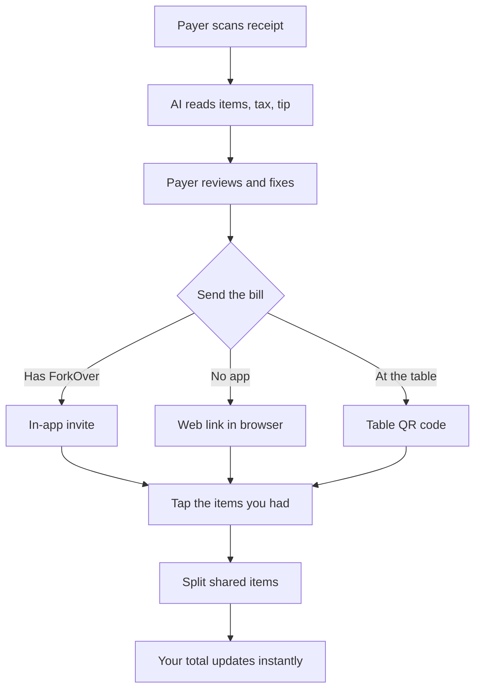

# ForkOver PRD

## Overview and problem statement

ForkOver is a photo-first bill splitter for iOS and Android: snap the receipt, everyone taps what they had, and every share adds up to the receipt total to the cent.

Splitting a group dinner today means one person pays, then someone does the math by hand or types every line into an app. Shared plates, tax, and tip slow it down, and rounding often leaves totals a few cents off the receipt, which invites second-guessing.

ForkOver removes the typing (AI reads the receipt), the negotiation (each person claims their own items), and the doubt (the math always reconciles).

## Goals and non-goals

ForkOver is a portfolio piece first and a revenue product second: when the two conflict, v1 favors a build that is live, easy to demo, and easy to explain in an interview.

**Goals for Tommy**

- Ship a live app on the App Store and Google Play, plus the web claiming page, that anyone can try from a link.
- Demonstrate agentic AI engineering end to end: AI receipt parsing with structured outputs, built through a Claude Code workflow with tests as the contract.
- Generate revenue as a secondary goal, with pricing set in Monetization.

**Goals for users**

- Split a group bill with one scan and a few taps, with no typing.
- Let anyone claim their items, whether they have the app or only a browser.
- Show each person's total instantly, with every share adding up to the receipt total to the cent.

**Non-goals for v1**

- Moving money inside ForkOver. People repay the payer in Venmo, through a link ForkOver prefills with the payer's Venmo username, the amount still owed, and a note naming the bill (FR-19).
- Matching friends from phone contacts. Friends are found by username, from past splits, or by QR code (FR-22, FR-23).
- Currency conversion. Bills are split in the receipt's own currency (FR-30).

## Target users and personas

v1 is built for friend groups splitting a restaurant bill. Coworker meals, trips, and roommates may work too, but v1's design decisions are made for the friend dinner.

Three roles show up at every meal:

- **The payer** puts one card down for the whole table, then scans, reviews, and sends the bill, and wants to be paid back without chasing anyone. The payer always has the app and an account.
- **The app user** is a friend who has ForkOver. They get the bill in the app or scan the table's QR code, tap their items, and pay on Venmo.
- **The guest** is a friend without the app. They open the link or QR code in a browser, type their name, and can do everything an app user can.

The guest experience doubles as ForkOver's main way to find new users: every bill shows the app to everyone at the table.

## Competitive landscape and positioning

ForkOver's core flow, where each friend claims their own items from their own phone, is already common, so ForkOver has to win on something other than the flow itself.

| App | Friends claim their own items? | Friends need the app? |
|---|---|---|
| [Tab](https://apps.apple.com/us/app/tab-the-simple-bill-splitter/id595068606) (Splitwise) | Yes, synced live | Yes |
| [Splitr](https://getsplitr.com/) | Yes, from a shared link | No |
| [Resplit](https://www.resplit.app/) | Yes, from a shared link | No |
| [Fairshare*s](https://fairshares.app/) | Yes, from a shared link | No, it runs in the browser |
| [SplitEven](https://getspliteven.com/) | No, the payer assigns items | No, friends view a breakdown |
| [ReceiptSplit](https://apps.apple.com/us/app/receiptsplit-split-scan/id6756941573) | No, the payer assigns items | No, friends get a text |
| [Splitceipt](https://splitceipt.com/blog/split-bill-with-friends-no-app/) | No, guests only review | No |

Splitr, Resplit, and Fairshare*s already let guests claim items from a link and pay on Venmo. Link-based claiming, proportional tax and tip, and Venmo links are table stakes, not differentiators.

**Positioning:** ForkOver competes on speed and polish: the fastest path from receipt to everyone knowing what they owe, in the best-feeling app in the category. Competitors already advertise speed, with [ReceiptSplit](https://apps.apple.com/us/app/receiptsplit-split-scan/id6756941573) and [Fairshare*s](https://fairshares.app/) claiming about 30 seconds and [SplitEven](https://getspliteven.com/) under 60, so ForkOver's speed targets must beat those numbers and be measured, not just claimed (see Success metrics).

## Core user journey

One person scans the receipt; everyone else claims their own items on their own device, in the app or in a browser, and sees what they owe the instant they tap.

Both paths end in the same claiming screen, so app users and browser guests get the same experience.

1. The payer scans the receipt. AI reads every line item, tax, and tip, and presents the bill in a clean, tappable layout.
2. The payer reviews the bill and fixes anything the AI misread.
3. The payer sends the bill: an in-app invite to people who have ForkOver, a web link to people who don't, or a QR code at the table that works for both.
4. Each person taps the items they had. For a shared item, they mark it as split among multiple people. The payer can also claim items on anyone's behalf, including friends added by name.
5. Each person's total updates instantly with every tap, with no loading.

A guest on the web link can do everything an app user can: claim items and split shared ones, without installing anything.

## Functional requirements (v1)

These are the v1 functional requirements. IDs are stable references for the spec, so later additions get new numbers rather than renumbering existing ones.

**Scan and read**

- FR-1: The payer photographs the receipt. AI extracts each line item with its price, plus tax, tip, and total, and shows the bill as a tappable list.
- FR-2: A line with a quantity, such as "2 x Draft Beer $14.00", becomes separate claimable items, here two Draft Beer items at $7.00 each. If the price doesn't divide evenly, the leftover cents go to one item so the items still add up to the line. The payer can merge them back during review.
- FR-3: The payer always reviews the bill before sending it, and can fix an item's name or price, add a missed item, or remove a wrong one. The review screen flags when the items don't add up to the printed subtotal, so misreads are easy to spot.

**Send**

- FR-4: The payer sends the bill in the app to people who have ForkOver accounts.
- FR-5: The payer shares a web link with people who don't have the app. The link opens the same claiming screen in any browser.

**Join**

- FR-6: A browser guest types their name when the link opens. The browser remembers them, so reopening the link keeps their name and claims.

**Claim**

- FR-7: Each person taps the items they had.
- FR-8: Any item can be marked as shared and split among multiple people.
- FR-9: Each person's total updates instantly on every tap, with no loading.

**Tax and tip**

- FR-10: Tax and tip are divided in proportion to each person's share of the items, including their portion of shared items. Someone whose items total $40 pays four times the tax and tip of someone whose items total $10.
- FR-11: The tip comes from the scanned receipt, whether it is printed, such as an automatic gratuity, or written in on the signed slip. The payer confirms or corrects it during review. If the receipt shows no readable tip, ForkOver assumes no tip, and the payer can add one during review.

**Unclaimed items**

- FR-12: The payer sees which items are still unclaimed, and can assign each one to a person or split it among several people.
- FR-13: Anything the payer doesn't assign is covered by the payer. Until an item is claimed or assigned, it counts toward the payer's own total, so everyone's totals always add up to the receipt.

**Conflicting claims**

- FR-14: If two or more people claim the same item without marking it shared, ForkOver allows it and flags the item for the payer, who resolves it by assigning it to one person or splitting it.
- FR-15: Until the payer resolves it, a flagged item is provisionally split between the people who claimed it and marked as pending, so it is never counted twice and totals still add up to the receipt.

**Pay back**

- FR-16: People can pay the payer back whenever they choose; paying doesn't wait for the rest of the table.
- FR-17: The payer can mark any item as paid. Once marked, that item's split locks, so an amount someone already paid can't change underneath them; the payer unmarks the item to edit it.
- FR-18: Each person sees what they've paid and what they still owe. Items assigned to them later show up as a remaining balance, along with their share of tax and tip.
- FR-19: Each person's total screen has a Pay on Venmo button, prefilled with the payer's Venmo username, the remaining amount owed, and a note naming the bill. Venmo links accept the amount and note as parameters and open in any browser ([source](https://splittyapp.com/learn/share-venmo-payment-link/)).

**Accounts**

- FR-20: App users sign in before first use, with Sign in with Apple or Google.
- FR-21: Browser guests never need an account; FR-6 still applies.
- FR-22: Each account has a ForkOver username. The payer finds friends to send a bill to by searching usernames or picking from people they've split with before.
- FR-23: The payer can show a QR code for the bill at the table. Scanning it opens the bill in the ForkOver app if it's installed, or in the browser if not.

**Account deletion**

- FR-33: Users can delete their account from inside the app, as Apple and Google Play require. Their username, sign-in, and bill history are deleted right away.
- FR-34: On bills someone else paid for, a deleted user's claims stay so no one else's total changes, and their name becomes "Deleted user." Bills the deleted user paid for are deleted, and their links show "This bill is no longer available."

**Notifications**

- FR-35: App users get a push notification when a bill is sent to them in the app.
- FR-36: The payer gets a push notification when a claim conflict needs resolving (FR-14) and when every item has been claimed, but not for individual claims. Browser guests receive no notifications.

**Editing after sending**

- FR-37: While the bill is open, the payer can edit it at any time: fix an item's name or price, add a missed item, or remove a wrong one. Only the payer can edit items; everyone else can only claim.
- FR-38: Claims on an edited item stay in place, and everyone sees updated totals instantly. Items marked paid stay locked until the payer unmarks them (FR-17). Removing an item removes its claims.

**Bill lifecycle**

- FR-24: A bill stays open for claiming until the payer closes it. The receipt photo is still deleted 30 days after the scan (NFR-5), even if the bill is open.
- FR-25: A closed bill becomes read-only history in the app, and its web link shows only a summary. The payer can still mark items as paid after closing, since late payments are normal.

**Split rules**

- FR-26: Leftover pennies from rounding go to the payer. Everyone else's share is rounded down to the cent and the payer's share is whatever remains, so nobody else ever pays more than their exact share and totals still match the receipt.
- FR-27: A discount on the whole receipt is divided in proportion to each person's item subtotal. Tax and tip shares are then based on each person's subtotal after the discount.
- FR-28: Anyone who has claimed no items owes $0, including fees split equally. Equal-split fees are shared only among people who claimed at least one item.
- FR-29: Extra fees on the receipt, such as a service charge or restaurant surcharge, are split in proportion to what each person ordered. The payer can switch any single fee to an even split during review.

**Currency**

- FR-30: v1 splits receipts in any currency, always in the receipt's own currency with no conversion. The AI detects the currency, amounts display in that currency's format, and the split math works in each currency's smallest unit, since yen has no cents and some currencies use three decimal places. Wherever this PRD says "cent," it means the smallest unit of the receipt's currency.
- FR-31: The Pay on Venmo button appears only on US dollar bills, since Venmo works only in US dollars. On other bills, each person sees what they owe and repays however the group prefers.

**Claiming for others**

- FR-32: After the scan, both the payer and everyone else can claim items. The payer can claim items on anyone's behalf, including people the payer adds by name because they can't claim for themselves, such as a friend whose phone died.

## Non-functional requirements

**Speed**

- NFR-1: Totals recompute on the device in under 100 ms per tap. Claims sync to everyone else in the background, so a tap never waits on the network.
- NFR-2: Median time from shutter press to bill sent is under 15 seconds (see Success metrics).

**Accuracy**

- NFR-3: Everyone's shares, plus anything left on the payer, add up exactly to the receipt total, to the cent. The app and the web page run the same TypeScript split engine, so both always show the same numbers.

**Privacy**

- NFR-4: Before the first scan, the app names Anthropic as the AI provider, explains that the receipt photo is sent to it to read the items, and asks for explicit permission. Apple's guideline 5.1.2(i) requires consent before any user data is shared with third-party AI ([source](https://stora.sh/blog/2026-05-06-apple-ai-consent-rule-5-1-2-i-implementation-guide)).
- NFR-5: Everyone on a bill can view its receipt photo. The photo is deleted 30 days after the scan.
- NFR-6: Bill links use long random IDs that can't be guessed. Anyone with the link can open the bill and claim items, which is what makes the sign-up-free guest flow possible.

**Platforms**

- NFR-7: iOS and Android apps built from one Expo codebase, plus a web claiming page that works in current mobile browsers.

**Connectivity**

- NFR-8: Claiming and scanning require a connection. When a device goes offline, ForkOver shows a clear no-connection banner and pauses taps, then resumes automatically when the connection returns. There is no offline queue in v1.

**Analytics**

- NFR-9: ForkOver records anonymous product analytics: timestamps for each step of the payer flow (shutter, parse done, review confirmed, sent), drop-off points, and free-to-Pro upgrades. It never records receipt contents, item names, or amounts, and uses no ad tracking. This is disclosed in the App Store and Google Play privacy sections.

**Accessibility**

- NFR-10: The app and the web page meet an accessibility baseline from the first screen built (M3). Every control and item has a clear screen reader label for VoiceOver and TalkBack, such as "Salmon, $28, claimed by you." Layouts hold up at larger system text sizes with nothing clipped. Claimed, unclaimed, and conflict states each use an icon or label, never color alone. Text meets WCAG AA contrast, checked automatically in tests.

## Success metrics

Speed is the headline metric because it is ForkOver's edge; accuracy is measured alongside it, because a fast wrong bill is worse than a slow right one.

**Speed**

- Median time from shutter press to bill sent, including review and tip: under 15 seconds, measured in real use from the anonymous step timings (NFR-9).
- Every tap updates totals in under 100 ms, computed on the device with no network wait.

**Latency budget for the 15 seconds**

| Step | Budget |
|---|---|
| Capture and upload the photo | 2 s |
| AI parse, streamed so items appear as they are read | 6 s |
| Payer reviews and taps "Looks right" | 4 s |
| Confirm the tip read from the receipt | 1 s |
| Send by QR code, link, or in the app | 2 s |
| **Total** | **15 s** |

Because the parse streams, the payer starts reviewing before it finishes, so review and parse overlap and the real total can come in under budget.

**AI accuracy**

- A labeled test set of real receipts measures how often the AI reads every item and price correctly, and how often the extracted items match the printed subtotal. The target is set after the first baseline run, and every prompt or model change is re-scored against the set before it ships.

## Monetization and cost model

ForkOver is free with a monthly allowance of receipt scans, and payers who need more subscribe to Pro. Claiming items is always free for app users and browser guests alike, since only the payer scans.

**Free tier:** 3 receipt scans per month per payer. Claiming items and the web link are never limited.

**Pro:** $1.99 per month for truly unlimited scans. A per-hour rate limit of about 10 scans stops scripted abuse without ever touching normal use, so Pro can honestly be marketed as unlimited. At the stores' 15% small-developer rate, Pro nets about $1.69 per subscriber per month, so a Pro payer scanning 30 receipts a month on Sonnet 5 (about $0.48 in AI cost) still leaves about $1.21.

**AI cost per scan (estimate)**

| Model | Input price | Output price | Est. cost per scan |
|---|---|---|---|
| Claude Haiku 4.5 | $1 per M tokens | $5 per M tokens | about $0.008 |
| Claude Sonnet 5 | $2 per M tokens | $10 per M tokens | about $0.016 |

The estimate assumes about 3,000 input tokens (the resized receipt photo plus instructions) and 1,000 output tokens (the structured item list) per scan, at [Anthropic's published prices](https://platform.claude.com/docs/en/about-claude/pricing). Real token counts get measured on the receipt test set.

At one to two cents a scan, AI cost is not what the free limit protects. The limit exists to drive Pro upgrades, and the Pro price only needs to clear store fees, hosting, and AI costs by a comfortable margin.

## Release plan

There is no fixed launch date. Milestones ship in order, and each ends with a concrete test of done. Receipt parsing comes second because the accuracy test set is the strongest portfolio piece and the biggest risk to the 15-second target.

| Milestone | What ships | Done when |
|---|---|---|
| M1: Split engine | The TypeScript split engine, extended for shared items, quantity lines, pending conflicts, and paid locks | The contract test suite passes, including new cases for FR-2, FR-15, FR-17, FR-26, FR-28, and FR-30 |
| M2: Receipt parsing | AI parsing with structured, streamed output, plus the labeled receipt test set | Baseline accuracy and speed are measured for Haiku 4.5 and Sonnet 5, and a model is chosen |
| M3: Payer app | Sign-in, AI consent, scan, review, tip, and splitting on a single phone | A full bill is split on one phone in under 15 seconds, median |
| M4: Shared bills | Backend, live sync, web claiming page, links, QR codes, usernames, in-app sending | Two app users and one browser guest claim the same bill live, with matching totals |
| M5: Payer controls | Unclaimed items, conflict flags, paid marking, Venmo buttons | One bill goes from scan to fully paid, end to end |
| M6: Pro and launch | Free and Pro tiers, photo deletion, store listings, TestFlight and Play internal testing | Approved on the App Store and Google Play |

## Risks and open questions

**Risks**

| Risk | Why it matters | Mitigation |
|---|---|---|
| Crowded market | Splitr, Resplit, and Fairshare*s already offer link-based claiming with Venmo | Compete on measured speed and polish; the portfolio value doesn't depend on market share |
| 15-second target | The AI parse on long receipts can use up the budget | Stream the parse, and choose the model using the receipt test set |
| Venmo link format | The links rely on a URL format, not a supported API, and could change | Build links in one function so a fix stays small |
| Sign-in and 3 free scans | Both add friction for first-time payers | One-tap Sign in with Apple, and track drop-off after launch |
| AI misreads | One wrong price makes several shares wrong | Payer review with the subtotal check (FR-3), and accuracy tracked on the test set |

**Open questions**

- None open. SPEC.md revision 2 implements this PRD and references every FR and NFR above. Its section 13 lists 16 implementation defaults for review, including the close-bill prompt and the unreadable-tip warning suggested here. Subscriptions are sold with native StoreKit 2 and Google Play Billing (react-native-iap) with server-side verification, not a third-party billing service. Contract tests: split.test.ts (51 tests, revised) and resolve.test.ts (16 tests, new).
